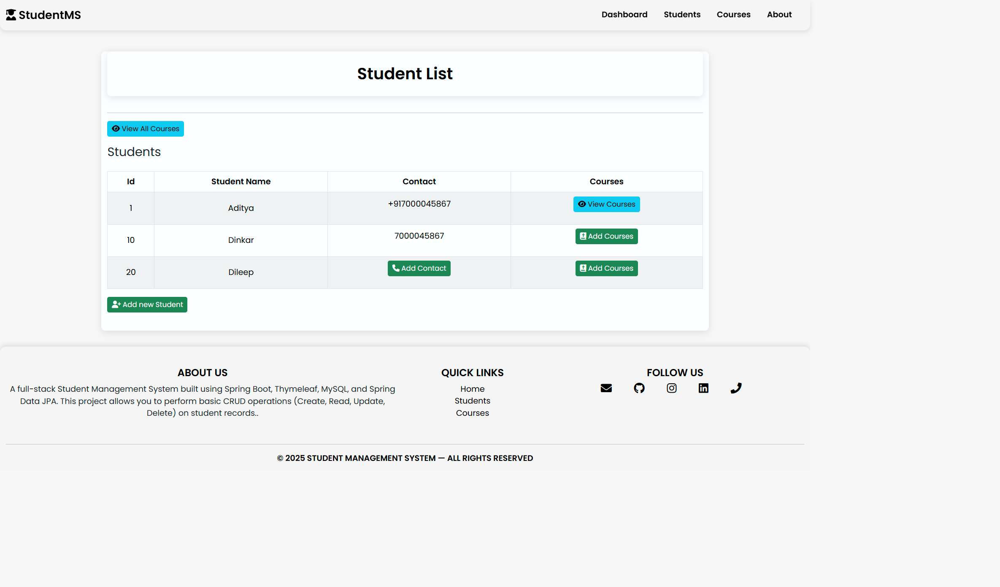
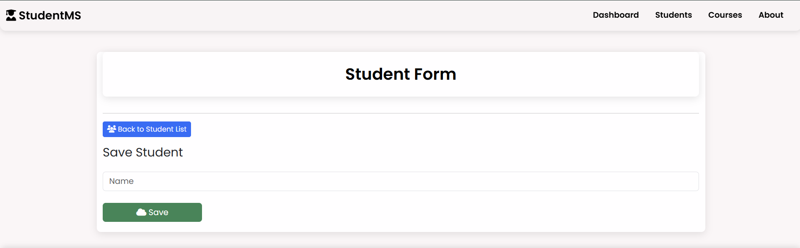
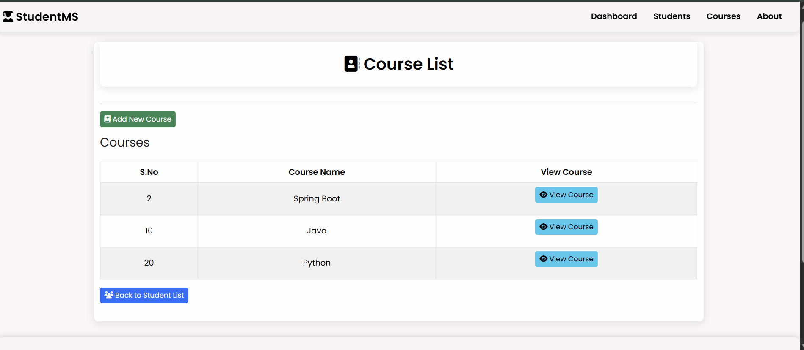

 # 🎓 Student Management System      
   
A **full-stack Student Management System** built using **Spring Boot, Thymeleaf, MySQL, and Spring Data JPA**.  
This project allows you to perform basic **CRUD (Create, Read, Update, Delete)** operations on student records, manage courses, and view course reviews in a simple web interface.
  
---      
         
## ✨ Features
### 👩‍🎓 Student Features  
- ➕ Add new students  
- 📋 View student list  
- ✏️ Update student details  
- ❌ Delete student records  
- ☎️ Manage and delete student contact information  

### 📚 Course Features
- ➕ Add new courses  
- ✏️ Update course details  
- ❌ Delete courses  
- ⭐ Add and view course reviews  

---

## 🛠️ Tech Stack
- ☕ **Backend:** Java, Spring Boot, Spring MVC, Spring Data JPA  
- 🎨 **Frontend:** Thymeleaf, HTML, CSS, Bootstrap  
- 🗄️ **Database:** MySQL, H2 (for testing)  
- 📦 **Build Tool:** Maven  
- 🔐 **Testing:** JUnit, Spring Boot Test

---
## 📸 Screenshot
All Data and Home Page:

Add Data :

Course Data :

Course Data :

---

    
## 🔗 Connect with me

 💼 [LinkedIn](https://www.linkedin.com/in/dinkarprasadjava)  |  🐙 [GitHub](https://github.com/DK12345678D) | 📧 [Gmail](mailto:dinkarprasad682@gmail.com) 
 
 ---

